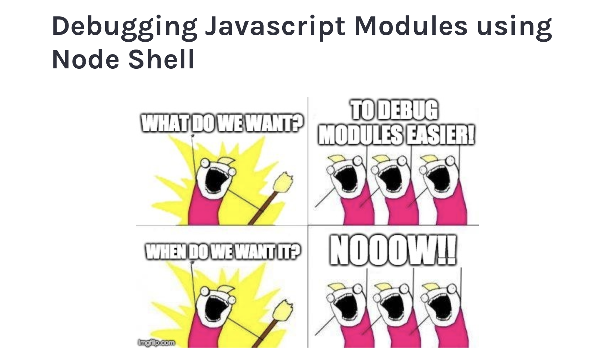

# node-shell-demo
Running Javascript Modules using node shell demo 

This repo is used to demo how to easier debug modules in Nodejs Api.
Full explanation with example is located on [cod34fun](https://cod34fun.com/debugging-javascript-modules-using-node-shell/) blog.

